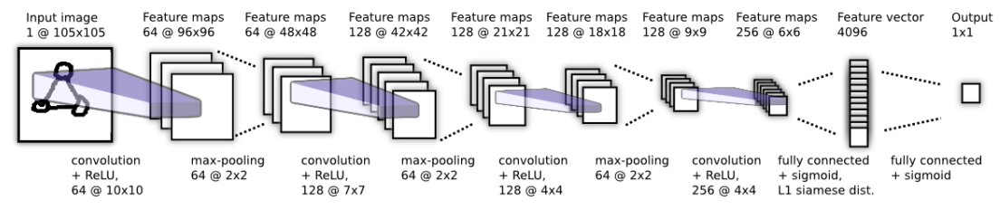
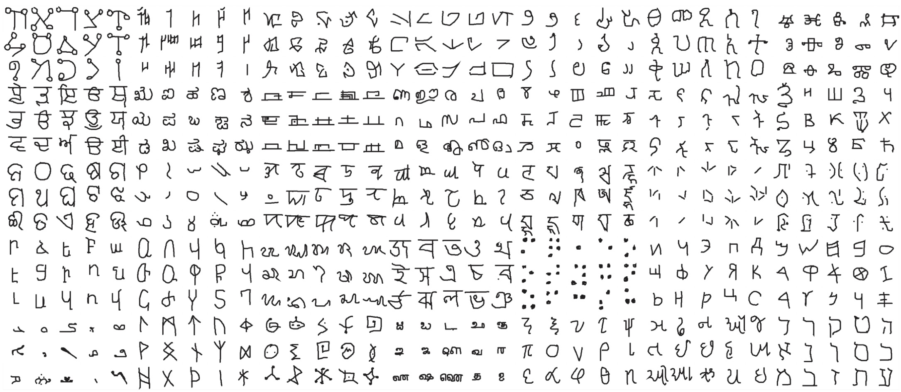

# One Shot Learning using Siamese Networks

`Paper implementation of "Siamese Neural Networks for One-shot Image Recognition" by Koch et. al. using the PyTorch framework on Omniglot Dataset`

## Introduction 

Siamese Networks are widely used for one shot learning tasks such as image verification and facial recognition. Siamese Nets calculate the degree of similarity or differences between given two images. The basic idea behind siamese nets is to pass two images one by one through a network and then compute the similarity score between the feature vectors produced during feedforward. In the [paper](https://www.cs.cmu.edu/~rsalakhu/papers/oneshot1.pdf), the authors have used a simple "siamese twin" convnet to compute the feature vectors. The L1 distance between the feature vectors is then passed through a fully connected layer to compute the final simmilarity score.

## Dataset 

[Omniglot dataset](https://github.com/brendenlake/omniglot) contains images of over 964 alphabets of different languages. Each alphabet contains 20 examples(drawers). I have used only the "background" set for training and validation. 30,000 pair of images are chosen randomly for training. The network is trained alternatively with similar and dissimilar examples, so 15,000 examples are "same image" examples and other 15,000 examples are "different image" examples. Only the first 12 drawers are chosen during training. Next four for validation and next for testing.

## Training

As mentioned above, I have used 30,000 training examples for the task. Some changes that I made during implementation which are different from the paper are:

- I have trained only for 10 epochs in contrast to 200 epochs mentioned in the paper as the losses were not decreasing significantly after that.
- I I have used global learning rate and momentum hyper parameters instead of layerwise hyper parameters.
- I have only used the "background" set of the Omniglot dataset.
- I have used the Adam optimizer instead of simple SGD with momentum.

## Code

The whole training was done on google colab. The [Siamese_colab.ipynb](https://github.com/ac-alpha/One-Shot-Learning-using-Siamese-Networks/blob/master/Siamese_colab.ipynb) notebook can be imported to colab for training. Dataset should be uploaded in Google drive. We need to mount the drive before using the dataset. 

## Results

On the validation set, an accuracy of 91.2% is recorded using the trained model. 
